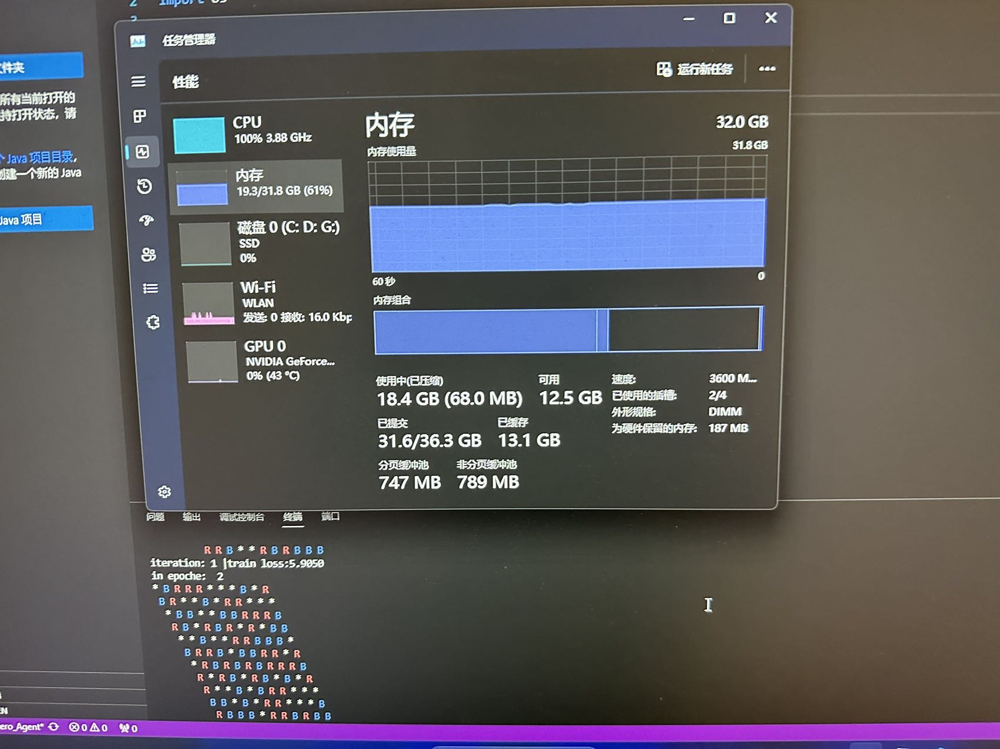

# Hex-Ultra 
This is a project for COMP34111: AI and Games, the aim of this project is to develop a Hex AI agent that can play Hex game with human players.

## Performance
Our group won all marking bots and achieved a very high reaction speed. We got the best performance on onaverage.

More details can be found below:

One unofficial test example is shown below:

You can also check the repo issue for more test results, we have uploaded several performance logs for test, test scripts are also provided.

## How to run
Please check `Hex Game Engine Documentation.pdf` in the root directory for more details.

## Ideas
We achieved our goal by 3 Stages in different branches:
1. We implemented the naive Monte Carlo Tree Search (MCTS) with UCT for Hex, along with a neural network to enhance the evaluation function(Check MCTS_Agent). 
2. Additionally, we developed a simple opening book and a parallelized version of MCTS to improve efficiency.(Check MCTS_Beta)
3. To further improve our performance, we deployed a Aplha-Zero pre-trained model and fine-tuned it to guide the MCTS search. (Check AlphaZero)

by the way, one stupid training process is shown below:

:) 

## Some useful repos:
 - KataGo: https://github.com/lightvector/KataGo
 - Azalea, a pre trained model for Hex: https://github.com/jseppanen/azalea
